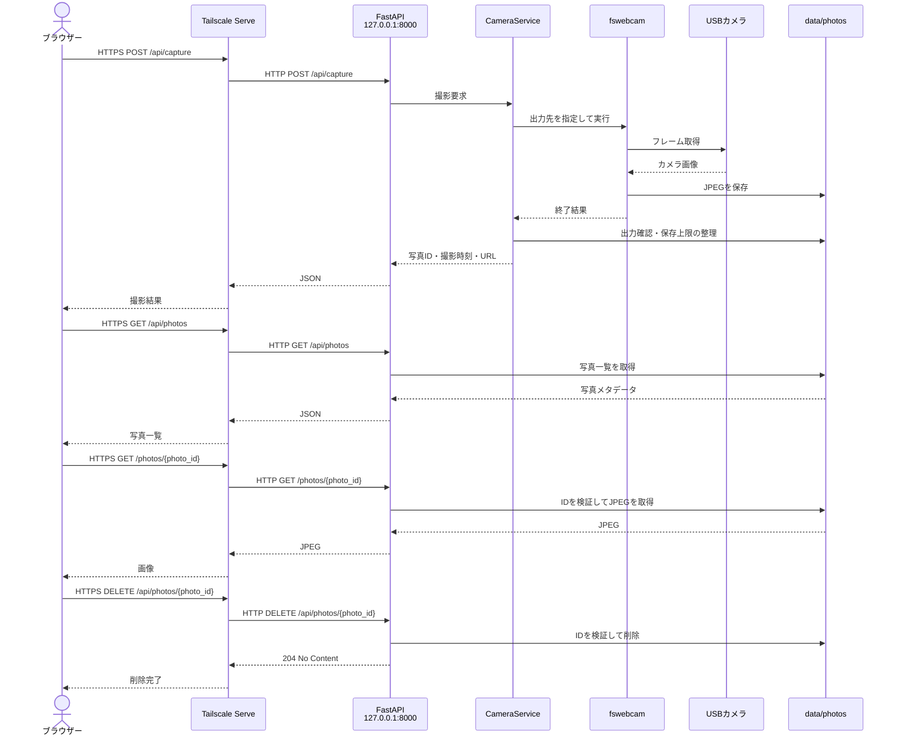

# raspi-camera-web

Raspberry Piに接続したカメラを、Tailscale内のブラウザーから操作するための小さなWebアプリです。

## 機能

- ブラウザーから写真を撮影
- 撮影結果をその場で表示
- 撮影した写真を8枚ずつ一覧表示
- 履歴写真の拡大表示と削除
- 保存枚数による自動整理
- 実カメラなしで試せるモック撮影

一般インターネットには公開せず、Tailscaleに参加している端末からだけ利用する構成を前提とします。

## 技術スタック

- Raspberry Pi 3B / Raspberry Pi OS（Python 3.9以上）
- USBカメラ / fswebcam
- Python 3 / FastAPI / Uvicorn
- Jinja2 / HTML / CSS / Vanilla JavaScript
- systemd
- Tailscale Serve

## 通信シーケンス



同一端末から`127.0.0.1:8000`へ直接接続する場合は、Tailscale Serveを経由しません。

## USBカメラで起動

先に [Raspberry PiとUSBカメラのセットアップ](docs/raspberry-pi-setup.md) に従って、`uv`、`fswebcam`、`v4l-utils`を準備します。その後、依存関係を同期します。

```bash
uv sync --python /usr/bin/python3 --no-python-downloads --no-dev --locked
```

USBカメラを接続し、撮影可能なV4L2デバイスとして認識されていることを確認します。

```bash
uv run --no-sync python scripts/check_usb_camera.py --device /dev/video0
```

`OK: 撮影可能なUSBカメラを1台認識しています。`と表示されたら、アプリと同じ条件でテスト撮影します。

```bash
fswebcam \
  --device /dev/video0 \
  --resolution 1280x720 \
  --no-banner \
  /tmp/raspi-camera-test.jpg
file /tmp/raspi-camera-test.jpg
```

JPEGとして保存できたら、実カメラバックエンドでアプリを起動します。

```bash
CAMERA_BACKEND=fswebcam \
CAMERA_DEVICE=/dev/video0 \
uv run --no-sync uvicorn app.main:app \
  --host 127.0.0.1 \
  --port 8000
```

同じ端末では`http://127.0.0.1:8000`を開きます。Tailscale内の別端末から接続する場合は、先にTailscale Serveを設定してHTTPSのURLを開きます。

常用時はUvicornをsystemdで常駐させ、Tailscale Serveから`127.0.0.1:8000`へ転送します。Tailscaleの設定は [docs/tailscale-setup.md](docs/tailscale-setup.md) を参照してください。

開発手順と現在の実装状況は [docs/development.md](docs/development.md) を参照してください。

## 想定API

```text
POST   /api/capture             写真を撮影する
GET    /api/photos              保存済み写真の一覧を取得する
GET    /photos/{photo_id}       写真を取得する
DELETE /api/photos/{photo_id}  写真を削除する
```

USBカメラは既定で `/dev/video0` と `fswebcam` を使用します。

## セキュリティ方針

- アプリは `127.0.0.1` のみで待ち受ける
- Tailscale Funnelは使用しない
- ルーターでHTTP、HTTPS、SSHのポートを開放しない
- 撮影操作には `POST` を使い、同時撮影と連打を制限する
- 撮影画像、秘密情報、端末固有設定はGitへ登録しない

## 開発者向け情報

実装方針と検証ルールは [AGENTS.md](AGENTS.md) に記載しています。
